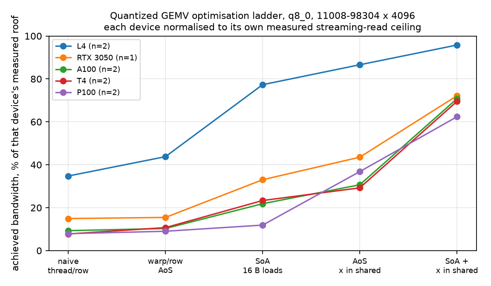
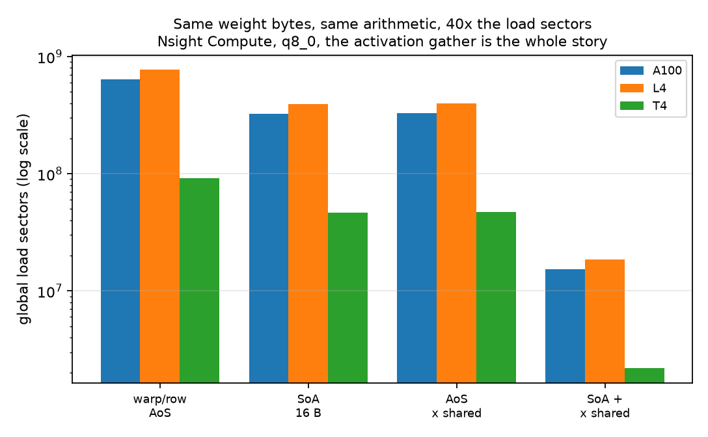
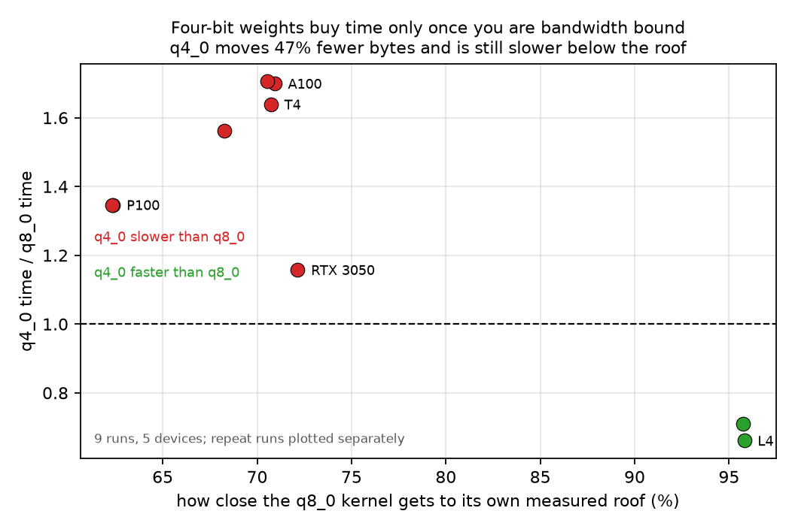

# Quantized GEMV: writing the kernel that hits the wall

[](https://github.com/manunicholasjacob/qgemv-roofline/actions/workflows/build.yml)
[](LICENSE)
[](https://doi.org/10.5281/zenodo.22164007)

One decode-path operation, written twelve ways and benchmarked in thirteen
configurations, measured against a bandwidth roof this repository measures for
itself.

**The badge means the code compiles for five architectures and the host-side
maths is right. It does not mean the kernels ran**, because GitHub runners have
no GPU. The kernel evidence is 39 device checks against a double-precision
reference, on five GPUs, in `results/`.

Earlier work here characterised LLM decode as memory-bandwidth-bound and fit a
roofline across six memory systems. The obvious objection to that work is that
it measures other people's kernels. This is the code that hits the wall, written
from scratch, with the optimisation sequence and the failures left in.

**Everything below was measured on the hardware it names.** No figure is
estimated, simulated, or carried over from a datasheet, and where a datasheet
figure appears it is labelled as one and is not used as a denominator without
saying so.

Measured on five GPUs across sm_60, sm_75, sm_80, sm_86 and sm_89. Full tables:
**[docs/RESULTS.md](docs/RESULTS.md)** and
**[docs/CROSS_ARCH.md](docs/CROSS_ARCH.md)**, both generated from `results/`.



Every device normalised to its own measured streaming-read ceiling. Four of the
five converge near 70%; the L4 reaches 96%, and that difference turns out to
decide which quantization format is faster.

## The operation

`y = W x`, where `W` is a `[M, K]` weight matrix quantized to ggml `q8_0` or
`q4_0` and `x` is an fp32 activation vector. This is the operation that dominates
batch-1 decode, and its arithmetic intensity is fixed by the format at roughly
1.9 FLOP per byte for `q8_0`, against a machine balance of roughly 36 FLOP per
byte for the fp32 arithmetic these kernels use. It cannot be anything but
memory-bound, which is what makes it a fair test of whether a kernel reaches
the roof.

The block layouts are byte-identical to `block_q8_0` and `block_q4_0`, so a row
of `W` here is a row of `W` in a GGUF file. That was not a convenience. Two of
the three findings below are about what that layout costs.

## Hardware

NVIDIA GeForce RTX 3050 Laptop GPU, sm_86, 16 SMs, 4 GB GDDR6, 128-bit bus, 1.5
MiB L2, driver 596.08. CUDA 13.2, gcc 15.2, under WSL2 on Windows 11.

Four gigabytes is small, and for this kernel it does not matter. The test shapes
are `4096 x 4096` and `11008 x 4096`, the attention-projection and MLP
up-projection shapes of a 7B model, which occupy 18 MB and 48 MB in `q8_0`,
against a 1.5 MiB L2. A third shape, `98304 x 4096` at 408 MiB, was added later
for the reason below.

**The working set has to be much larger than L2 or the timing loop measures
cache bandwidth and reports it as memory bandwidth.** That is comfortably true
here at 30x the L2, and it was not true on two of the datacenter parts this was
later run on: the L4 has 48 MiB of L2 against a 45.7 MiB matrix, and reported a
kernel running at 274% of its own measured DRAM roof, which is impossible and is
how the problem was caught. The cross-architecture page marks those figures
device L2 instead of assuming a shape, and every cloud run was repeated at an
L2-safe shape. On this card the large shape reproduces the 48 MB result exactly,
121.5 GB/s at 408 MiB against 121.8 at 48 MB, so nothing here was cache-flattered.

One further caveat, found by repeating rather than by reasoning. The ALU-bound
`q4_0` kernel at the 408 MiB shape reported 5.007 ms in one session and 3.99 ms
in the next four, while the memory-bound `q8_0` kernel moved 1.7% across the
same sessions. Within-run spread was 0.5% in every case. **The within-run
standard deviation understated the real uncertainty on that kernel by a factor
of about fifty**, which is why the cloud notebook now repeats its headline shape
three times and reports the spread across repeats, not within them.

## The roof, measured three ways

| measurement | GB/s |
|---|---|
| device-reported peak (5.501 GHz x 2 x 128 bit / 8) | 176.0 |
| streaming read, 512 MiB, measured | **171.4** |
| device-to-device copy | 168.1 |
| cuBLAS fp16 matvec, same shape | 168.7 |

The streaming read reaches 97.4% of the device-reported peak, and cuBLAS on an
unquantized matvec of the same shape independently lands at 98.4% of the
streaming read. Two unrelated paths agree, so 171.4 GB/s is used as the roof
throughout and the datasheet number is not.

One note on that peak, because it matters for anything that quotes a percentage.
The card reports a 5.501 GHz memory clock on a 128-bit bus, which is 176.0 GB/s,
not the 192 GB/s that the 12 Gbps variant of this part carries. Percentages of
peak computed against 192 for this specific card are understated by about 9%.

## Finding 1: the optimisation sequence, and where it comes from

At `11008 x 4096`, `q8_0`:

| kernel | weight layout | x lives in | ms | GB/s | % of roof |
|---|---|---|---|---|---|
| `q8_v0_naive` | ggml AoS | global | 2.0398 | 23.5 | 13.7% |
| `q8_v1_warp` | ggml AoS | global | 1.8225 | 26.3 | 15.3% |
| `q8_v3_soa_vec` | SoA, 16 B loads | global | 0.8588 | 55.8 | 32.5% |
| `q8_v2_smem_x` | ggml AoS | shared | 0.6459 | 74.2 | 43.3% |
| `q8_v5_soa_smem` | SoA, 16 B loads | shared | **0.3932** | **121.8** | **71.1%** |

**5.19x from the naive kernel to the best one**, ending at 71.1% of the measured
roof. The gap that remains is discussed under limitations, and it is not closed.

The middle of that table is the part worth reading. The two changes were
separated deliberately, because the first version of this experiment confounded
them:

| change | speedup over the AoS baseline |
|---|---|
| weight layout only (AoS to SoA) | 2.12x |
| activation placement only (global to shared) | **2.82x** |
| both | 4.63x |

**Staging the activation vector in shared memory mattered more than the weight
layout, on a kernel where the weights outweigh the activations by three orders
of magnitude.** That is the opposite of where the bytes are, and it is the whole
point.



The mechanism is the access pattern, not the volume. When one warp owns a row
and lane `l` takes block `l`, the 32 lanes are reading 32 different 128-byte
regions of `x` in the same instruction. That is a 32-way gather issued once per
block per warp, and it stalls the load pipe long before the weight stream
saturates DRAM. Staging `x` once per block converts it into a broadcast.

The two effects multiply to 5.99x in isolation but deliver 4.63x together. They
are not independent, because both were relieving the same stall.

## Finding 2: the naive kernel beats the optimised one, for `q4_0`

| kernel | ms |
|---|---|
| `q4_v0_naive`, thread per row | 1.1110 |
| `q4_v1_warp`, warp per row | 1.7326 |

The textbook optimisation makes it **1.56x slower**. The naive kernel puts every
thread in a block on the same block index at the same time, so all 256 threads
read the *same* elements of `x` and the hardware broadcasts them for free. Its
weight access is genuinely terrible and it does not matter, because `x` was the
bottleneck and the naive schedule happened to solve it by accident.

This is why the ladder in this repository is a ladder and not a single number. A
sequence that only reported the endpoint would have shown a 2.44x win and hidden
the fact that step one was a regression.

## Finding 3: four-bit weights lose, until the eight-bit kernel hits the roof

This one was first written as a flat claim and it did not survive. The flat
version: `q4_0` moves 47% fewer weight bytes than `q8_0` and is nonetheless
slower. That held on the RTX 3050 at every shape, and on the P100, T4 and A100
at an L2-safe shape. It **failed on the L4**, and the failure is the useful
part.

| device | q8_0 as fraction of its measured roof | q4_0 / q8_0 time |
|---|---|---|
| NVIDIA L4 | **95.8%** | **0.66x** |
| RTX 3050 Laptop | 72.1% | 1.16x |
| Tesla T4 | 70.7% | 1.64x |
| A100-SXM4-40GB | 70.5% | 1.71x |
| Tesla P100 | 62.4% | 1.35x |



**`q4_0` wins exactly where `q8_0` is already at the memory roof, and loses
everywhere it is not.** On the L4 the `q8_0` kernel reads DRAM at 95.7% of peak
by the profiler's count, so there is nothing further to extract from the memory
system and the only remaining lever is to move fewer bytes. Everywhere else the
`q8_0` kernel sits around 70% of its roof, there is memory headroom going
unused, and the unpacking arithmetic costs more than the bytes save.

So the statement worth keeping is conditional, and it is just the roofline
applied honestly: **fewer bytes buys time only once you are actually bandwidth
bound.** Quantizing further to escape a bottleneck you have not yet reached
makes things worse.

The cause of the loss is the unpacking: two mask-and-shift operations and two
float conversions per byte instead of one conversion, roughly three times the
ALU work per byte on half the bytes. The profiler confirms it. Across the T4,
L4 and A100 the `q4_0` kernel runs at about **1.8x the compute-to-memory
throughput ratio** of the `q8_0` kernel, and executes more instructions while
reading 47% fewer bytes.

Energy on the RTX 3050 tells the same story, on a machine below its roof:

| kernel | mean W | mJ per call | pJ per weight byte |
|---|---|---|---|
| `q8_v0_naive` | 23.83 | 66.156 | 1381 |
| `q8_v2_smem_x` | 32.58 | 26.226 | 547 |
| `q8_v5_soa_smem` | 28.05 | **13.679** | **286** |
| `q4_v5_soa_smem` | 22.72 | 16.263 | 641 |

**Energy per call fell 4.84x from the naive kernel to the best one while mean
power rose from 23.8 W to 28.1 W**, which is the argument for racing to idle
stated in joules on a 40 W part. And on this card `q4_0` costs 1.19x the energy
per call of `q8_0` and 2.25x the energy per byte moved. On the L4, where `q4_0`
wins on time, it is also the cheaper of the two per call.

`llama.cpp` sidesteps the whole problem by quantizing the activation vector to
`q8_1` and using `__dp4a` integer dot products, which was checked in
`ggml-cuda/mmvq.cu` rather than assumed.

## Trying to fix finding 3, and failing

If the `q4_0` penalty is unpacking arithmetic, cutting the unpacking arithmetic
should narrow it. `q4_v6_fastunpack` is that test. It lifts the `-8` bias out of
the inner loop by algebra, since `sum((q-8)*x) = sum(q*x) - 8*sum(x)` and the
block sum of `x` does not depend on the row, and it extracts nibbles four bytes
at a time with a 32-bit mask instead of one byte at a time. Together those
remove roughly a quarter of the integer operations per weight.

| shape | `q4_v5_soa_smem` | `q4_v6_fastunpack` | |
|---|---|---|---|
| 4096 x 4096 | 0.1761 ms | 0.1811 ms | 1.03x slower |
| 11008 x 4096 | 0.4526 ms | 0.4587 ms | 1.01x slower |
| 98304 x 4096 | 5.0074 ms | 4.9326 ms | 0.99x faster |

**It changed nothing**, and it doubled the relative error from `1.3e-07` to
`2.7e-07` through the cancellation the algebra introduces. Removing a quarter of
the integer work bought nothing at all.

That is a real result and it narrows the mechanism rather than confirming it.
The cost is not the masking, shifting and subtracting. What v6 does **not**
touch is the integer-to-float conversion, one per weight, which runs at reduced
throughput on these parts, and the FMA count, which is fixed by the format. The
honest statement is therefore: `q4_0` is ALU bound, the profiler shows it, and
the specific instruction responsible is **not** the bit manipulation. Testing
that properly needs a variant that removes the conversion itself, and the
numerically safe way to do that is what `llama.cpp` already does, which is to
quantize the activation vector and use integer dot products.

The kernel is kept in the repository. A failed optimisation that narrows the
hypothesis is worth more than one that was never tried.

## What did not work

- **Splitting a row across multiple warps** (`q8_v4_split2`, `q8_v4_split4`) did
  nothing: 55.5 and 54.8 GB/s against 55.9 for one warp per row. With M in the
  thousands there was never an occupancy shortage to fix, so the extra reduction
  was pure overhead. It is kept in the repository because the reasoning for
  trying it was sound and the measurement is what settled it.
- **Vectorising loads on the ggml AoS layout** is not possible. `block_q8_0` is
  34 bytes and `block_q4_0` is 18, neither a multiple of 4, so the quant array
  lands at a 4-byte-misaligned offset for half the blocks and a 16-byte `int4`
  load is illegal. The SoA plane exists because of this, and repacking is the
  only way to get a wide load out of a GGUF row.
- **The fast-unpack kernel above.** Kept, in its own section, because the
  negative result is the informative part.
- **Shared-memory staging does not scale in K.** At K=8192 the `x` tile is 32 KB
  per block, which caps residency at one block per SM and drops `q8_v5` from its
  131.9 GB/s peak at K=2048 to 103.6 GB/s. The fix is to tile `x` rather than
  stage all of it, and that is not implemented here.

## Limitations

1. **71% of the roof is not the roof.** The best kernel leaves 29% on the
   table. The best available hypothesis is the K=8192 occupancy result above:
   shared-memory pressure and the per-row warp reduction both cost residency,
   and neither was tuned. This is a measured shortfall with a hypothesis, not a
   solved problem.
2. **The limiter is measured on the datacenter parts and inferred on this one.**
   Nsight Compute returns `ERR_NVGPUCTRPERM` locally and `compute-sanitizer`
   cannot attach under WDDM, so on the RTX 3050 the mechanism rests on the 2x2
   factorial rather than on counters. Being root is not the fix: the Kaggle run
   has `ncu` installed and executes as uid 0 and counters are refused there
   anyway, because the driver gates them independently of the user. Colab does
   grant them, and `docs/CROSS_ARCH.md` carries the counters for the T4, L4 and
   A100. They agree with the factorial: the slow kernel issues over forty times
   the global load sectors for identical weight traffic, and `q4_0` runs at a
   compute-to-memory throughput ratio about 1.8x that of `q8_0` on every device.
   The local claims are therefore corroborated elsewhere rather than measured
   here, which is weaker than measuring them here and stronger than not
   checking.
3. **Nothing here beats a vendor library, and nothing here tries to.** cuBLAS
   reaches 98.4% of the roof on the fp16 matvec. The comparison in this
   repository is against the memory system, not against NVIDIA.
4. **Finding 3 is about these kernels.** `llama.cpp` does not pay the `q4_0`
   unpacking cost the same way: its CUDA matvec path quantizes the activation
   vector to `q8_1` and uses integer dot products, so the unpack folds into
   `__dp4a` and the activation gather that dominates Finding 1 never arises. So
   the correct reading of Findings 1 and 3 together is that they independently
   reproduce the reason the production kernel makes the design choice it makes.
   They are not a defect report against it.
5. **Energy was measured on one part only.** The P100 does not implement
   `nvmlDeviceGetTotalEnergyConsumption`; the notebook probes for it and reports
   `energy counter NOT supported` rather than silently substituting an
   integrated estimate. So the energy column exists for sm_86 and not for
   sm_60, and no cross-architecture energy claim is made.
6. **The idle baseline moved.** Idle draw measured 3.215 W before the energy
   sweep and 1.913 W after. Every above-idle energy figure carries that 1.3 W
   of uncertainty, which is why the table above quotes total energy per call
   rather than above-idle energy.
7. **Clocks were not locked.** This is a laptop part with a 40 W limit and it
   boosts. Timing is the median of 200 samples after 20 warm-up iterations, with
   the spread reported in `results/`, but a thermally cold run and a hot one are
   not identical and no attempt was made to pin the clock.

## Layout

```
src/qgemv_kernels.cuh   nine kernels: two formats x {AoS, SoA} x {x global, x shared}
src/bench.cu            correctness against a double-precision CPU reference, then timing
python/qformats.py      ggml q8_0 and q4_0 in pure PyTorch, no GPU needed
python/triton_qgemv.py  the same kernel in Triton, plus PyTorch reference and cuBLAS
scripts/energy_probe.py NVML monotonic energy counter, two reads per window, never sampled
scripts/summarize.py    regenerates docs/RESULTS.md from results/
scripts/crossarch.py    regenerates docs/CROSS_ARCH.md across every device
scripts/figures.py      the three figures, from results/
scripts/make_portable_notebook.py  embeds src/ into a notebook for Kaggle or Colab
scripts/crossarch.py    regenerates docs/CROSS_ARCH.md from the local and cloud runs
results/                every measurement: local as JSONL, cloud runs as JSON
```

## Testing, and what the badge does not mean

Two layers, because only one of them can run in CI.

**On device, which is the real evidence.** `tests/test_correctness.py` checks
every kernel against a double-precision CPU reference over the same quantized
bytes, at three shapes. 39 checks locally, and the same checks ran on all five
GPUs through the notebooks. Worst relative error anywhere, across five
architectures: **5.6e-07**, against a stated tolerance of 1e-5.

**In CI, which is weaker and says so.** GitHub-hosted runners have no GPU, so
the workflow cannot execute a kernel or verify a number. It compiles every
kernel for sm_60, sm_75, sm_80, sm_86 and sm_89 to catch build breakage, and
runs `tests/test_quant_cpu.py`, which checks the quantizers on CPU: round-trip
inside a bound derived from the format rather than fitted to the data, the ggml
nibble order, and the byte counts every GB/s figure depends on.

A green badge here means the code builds and the host-side maths is right. It
does not mean the kernels were run. Conflating those would be the exact failure
this repository is about.

## Reproducing

```
make            # builds to $HOME/kgbuild, out of any synced folder
make bench      # ceiling, then both shapes, into results/
make triton     # Triton and cuBLAS comparison
make summary    # regenerate docs/RESULTS.md
```

Correctness runs on every kernel before it is timed, against a double-precision
CPU reference over the same quantized bytes. Maximum relative error across all
nine kernels and both shapes is `4.5e-07`, and a kernel whose output does not
match is timed anyway so that the error is visible rather than fatal.

## Method notes worth stating

- Timing is CUDA-event based, 20 warm-up iterations, median of 200, with min,
  p95 and standard deviation recorded in the JSONL. A single sample of a GPU
  kernel is not a measurement.
- Energy uses `nvmlDeviceGetTotalEnergyConsumption`, read exactly twice per
  window. It is never sampled. On this specific card, sampling
  `nvmlDeviceGetPowerUsage` at 20 Hz raised the measured idle draw from 0.233 W
  to 4.297 W, an extra 4.06 W on a 40 W part, so the sampler cannot be used to
  measure anything small.
- The byte count used for GB/s is the weight bytes only: `M * K * 34/32` for
  `q8_0` and `M * K * 18/32` for `q4_0`, identical between the AoS and SoA
  layouts so the two are directly comparable. The activation vector and the
  output are three orders of magnitude smaller and are excluded, which flatters
  no kernel over another.
